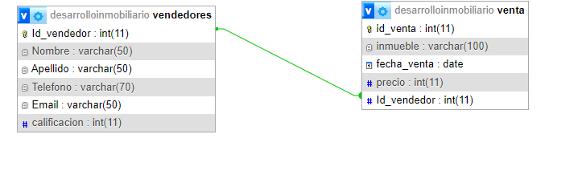

INTEGRANTES
 .Lucia Micaela Moreira 
 .Beatriz Noemí MuñoZ

DESCRIPCION
Nuestro trabajo especial estará enfocado en el desarrollo de una plataforma inmobiliaria utilizando PHP, ya que es el lenguaje principal abordado dentro de la materia. El proyecto tiene como objetivo crear una aplicación web que permita la gestión de propiedades inmobiliarias. Esta plataforma se diseñará para optimizar los procesos de búsqueda, registro y administración de inmuebles.

La plataforma inmobiliaria incluirá funcionalidades esenciales:
Con dos tablas para relacionar venta y vendedores de los inmuebles, y su interrelación, a través de id_vendedor y la clave foránea.

RF DER
